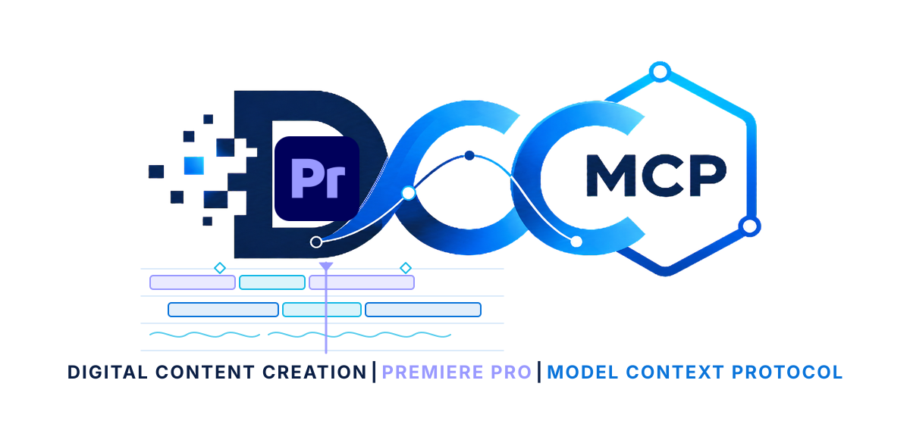

# dcc-mcp-premiere

<p align="center">
  
</p>

## Agent workflow

AI agents should use the shared gateway through `dcc-mcp-cli`; IDE users may
continue to use the MCP endpoint. Prefer typed skills and tools over raw scripts.

### Install or update the CLI

`dcc-mcp-cli` is the preferred control path for every shell-capable agent. If
it is missing, ask the user before installing the latest official release:

```bash
# Linux/macOS
curl -fsSL https://raw.githubusercontent.com/dcc-mcp/dcc-mcp-core/main/scripts/install-cli.sh | sh

# Windows PowerShell
powershell -ExecutionPolicy Bypass -c "irm https://raw.githubusercontent.com/dcc-mcp/dcc-mcp-core/main/scripts/install-cli.ps1 | iex"
```

Keep an official build current through the release manifest:

```bash
dcc-mcp-cli update check
dcc-mcp-cli update apply
```

`update apply` downloads and stages the latest CLI for the next launch. It
does not update a running `dcc-mcp-server`; update that server in its own
environment.

```bash
dcc-mcp-cli dcc-types
dcc-mcp-cli list
dcc-mcp-cli search --query "<task>" --dcc-type premiere
dcc-mcp-cli describe <tool-slug>
dcc-mcp-cli call <tool-slug> --json '{"key":"value"}'
```

`dcc-types` reports release-catalog support; `list` reports live sessions. If a
tool belongs to an inactive progressive skill, call `dcc-mcp-cli load-skill <skill-name> --dcc-type premiere` before retrying. For post-task improvement,
attach a stable session id with `--meta-json`, query `dcc-mcp-cli stats --range 24h --session-id <task-id>`, then pass the bounded evidence to the
`review_skill_improvement` prompt from `dcc-mcp-skills-creator`.


MCP adapter for Adobe Premiere Pro, built on the shared `adobepy` broker, UXP bridge, and typed facade.

```bash
pip install dcc-mcp-premiere
```

Install the shared bridge with `adobepy install-bridge premiere --dest <plugin-dir> --token <token>`, load it with Adobe UXP Developer Tool in Premiere Pro 25.6 or later, then start the adapter. Each adapter instance uses an OS-assigned port and registers it for CLI discovery. Connect through the stable gateway at `http://127.0.0.1:9765/mcp`; set `DCC_MCP_PREMIERE_PORT` only when a fixed direct endpoint is required.

Set `ADOBEPY_TOKEN` to the same non-default token used when installing the bridge.

## Tools

- `premiere-project.inspect_project`
- `premiere-project.list_sequences`
- `premiere-project.save_project`
